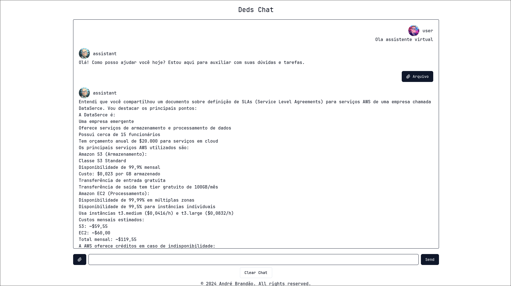

# Deds GPT

Projeto desenvolvido para a matéria de TOPICOS 3 na PUC-MG



## Instruções

### Instalando o projeto

Faça um clone do projeto localmente e instale as dependencias utilizando algum package manager de sua escolha

```bash
npm install
# or
pnpm install
# or
bun install
```

Para roda o projeto localmente é necessario adicionar o chave da Anthropic(https://www.anthropic.com/) no arquivo .env

Recomendo apenas renomear o .env.exemple para env e adicionar a chave da api

.env deve ficar assim

```txt
ANT_KEY="sk_YOUR_ANTROPIC_KEY...."
```

Para rodar a aplicação localmente basta utilizar o comando de dev localizado no arquivo package.json ou usando o package manager

```bash
npm run dev
#or
pnpm run dev
#or
bun run dev
```
